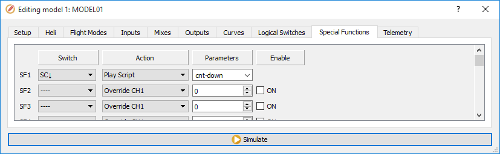
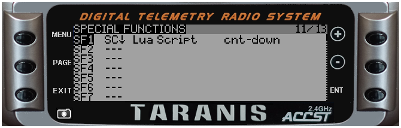

# Function Scripts

#####Overview

Function scripts are invoked via the **'Lua Script'** option of Special Functions configuration page.





##### Typical uses

* specialized handling in response to switch position changes
* customized announcements

##### Limitations

* should not exceed allowed run-time/ number of instructions.
* all function scripts are stopped while one-time script is running (see Lua One-time scripts)
* Version 2.1 function scripts **DO NOT HAVE ACCESS TO LCD DISPLAY**

##### Location

Place them on SD card in folder /SCRIPTS/FUNCTIONS/

##### Lifetime

* script *init* function is called once when model is loaded
* script *run* function is periodically called as long as switch condition is true
* script is stopped and disabled if it misbehaves (too long runtime, error in code, low memory)


##### Script interface definition

Every function script must include a *return* statement at the end, that defines its interface to the rest of OpenTX code. This statement defines:
* script *init* function (optional, see [Init Function Syntax](init_function_syntax.md))
* script *run* function (see [Run Function Syntax](run_function_syntax.md))

#####Example (interface only):
```lua
local function init_func()
end

local function run_func()
end

return { run=run_func, init=init_func }
```

#####Notes:
* local variables retain their values for as long as the model is loaded regardless of switch condition value
 

#####Advanced example (save as /SCRIPTS/FUNCTIONS/cnt-down.lua)

The script below is an example of customized countdown announcements. Note that the init function determines which version of OpenTX is running and sets the unit parameter for playNumber() accordingly.

```lua


local lstannounce
local target

local running = false

local duration = 120 -- two minute countdown
local announcements = { 120, 105, 90, 75, 60, 55, 50, 45, 40, 35, 30, 29, 28, 27, 26, 25, 24, 23, 22, 21, 20, 19, 18, 17, 16, 15, 14, 13, 12, 11, 10, 9, 8, 7, 6, 5, 4, 3, 2, 1, 0}
local annIndex

local minUnit

local function init()
  local version = getVersion()
  if version < "2.1" then
    minUnit = 16 -- must be running OpenTX 2.0
  else
    minUnit = 23
  end
end

local function run()
  
  local timenow = getTime() -- 10ms tick count
  local remaining
  local minutes
  local seconds
  
  if not running then
    running = true
    target = timenow + (duration * 100)
    annIndex = 1
  end
  
  remaining = math.floor(((target - timenow) / 100) + .7) --  +.7 adjust for announcement lag
  
  if remaining < 0 then
    running = false -- we were 'paused' and missed zero
    return
  end
  
  while remaining < announcements[annIndex] do
    annIndex = annIndex + 1 -- catch up in case we were paused
  end
    
  if remaining == announcements[annIndex] then
    minutes = math.floor(remaining / 60)
    seconds = remaining % 60
    if minutes > 0 then
      playNumber(minutes, minUnit, 0)
    end
    if seconds > 0 then
      playNumber(seconds, 0, 0)
    end
    annIndex = annIndex + 1
  end
  
  if remaining <= 0 then
    playNumber(0,0,0)
    running = false
  end

end

return { init=init, run=run }
```


