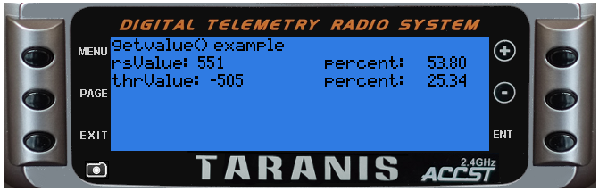

<!-- This file was generated by the script. Do not edit it, any changes will be lost! -->

## getValue(source)


Returns the value of a source. 

The list of valid sources is available:
* for OpenTX 2.0.x at http://downloads-20.open-tx.org/firmware/lua_fields.txt
* for OpenTX 2.1.x at http://downloads-21.open-tx.org/firmware/lua_fields.txt (depreciated)
* for OpenTX 2.1.x Taranis and Taranis Plus at http://downloads-21.open-tx.org/firmware/lua_fields_taranis.txt
* for OpenTX 2.1.x Taranis X9E at http://downloads-21.open-tx.org/firmware/lua_fields_taranis_x9e.txt

In OpenTX 2.1.x the telemetry sources no longer have a predefined name. 
To get a telemetry value simply use it's sensor name. For example:
 * Altitude sensor has a name "Alt"
 * to get the current altitude use the source "Alt"
 * to get the minimum altitude use the source "Alt-", to get the maximum use "Alt+"

@status current Introduced in 2.0.0, changed in 2.1.0


#### Parameters

* `source`  can be an identifier (number) (which was obtained by the getFieldInfo())
or a name (string) of the source.


#### Return value

* `value` current source value (number). Zero is returned for:
 * non-existing sources
 * for all telemetry source when the telemetry stream is not received

* `table` GPS position is returned in a table:
 * `lat` (number) latitude, positive is North 
 * `lon` (number) longitude, positive is East
 * `pilot-lat` (number) pilot latitude, positive is North 
 * `pilot-lon` (number) pilot longitude, positive is East

* `table` GPS date/time, see getDateTime()

* `table` Cells are returned in a table 
(except where no cells were detected in which 
case the returned value is 0):
 * table has one item for each detected cell:
  * key (number) cell number (1 to number of cells)
  * value (number) current cell voltage


##### Notice
Getting a value by its numerical identifier is faster then by its name.


---

### Examples

<a class="dlbtn" href="https://raw.githubusercontent.com/opentx/lua-reference-guide/master/general/getValue-example.lua">general/getValue-example</a>

```lua
local function run(e)
  --
  -- NOTE: analog values (e.g. sticks and sliders) typically range from -1024 to +1024
  --       divide by 10.24 to scale into -100% thru +100%
  --       or add 1024 and divide by 20.48 to scale into 0% thru 100%
  --
  local rsValue = getValue('rs')
  local thrValue = getValue('thr')
  lcd.clear()
  lcd.drawText(1, 1, "getvalue() example",0)
  lcd.drawText(1, 11, "rsValue: ", 0)
  lcd.drawText(lcd.getLastPos() + 2, 11, rsValue, 0)
  lcd.drawText(120, 11, "percent: ", 0)
  lcd.drawNumber(lcd.getLastPos() + 32, 11, rsValue / 10.24, PREC2)
  lcd.drawText(1, 21, "thrValue: ", 0)
  lcd.drawText(lcd.getLastPos() + 2, 21, thrValue, 0)
  lcd.drawText(120, 21, "percent: ", 0)
  lcd.drawNumber(lcd.getLastPos() + 32, 21, (thrValue + 1024) / 20.48, PREC2)
end

return{run=run}
```



