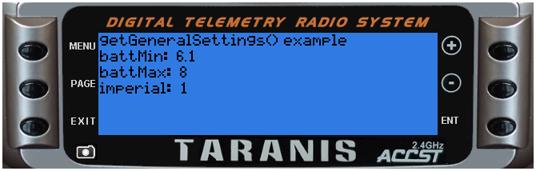

# getGeneralSettings()

#####Overview
Returns current radio settings values via a Lua table

 - Parameters: none
 - Returns: settings values (as a Lua string) containing members:
   - battMin
   - battMax
   - imperial
 - Status: current Introduced in 2.1

#####Example telemetry script

```lua

local function run(e)
  local settings = getGeneralSettings()
  lcd.clear()
  lcd.drawText(1,1,"getGeneralSettings() example",0)
  lcd.drawText(1,11,"battMin: ", 0)
  lcd.drawText(lcd.getLastPos()+2,11,settings['battMin'],0)
  lcd.drawText(1,21,"battMax: ", 0)
  lcd.drawText(lcd.getLastPos()+2,21,settings['battMax'],0)
  lcd.drawText(1,31,"imperial: ", 0)
  lcd.drawText(lcd.getLastPos()+2,31,settings['imperial'],0)
end

return{run=run}
```

#####Example output
