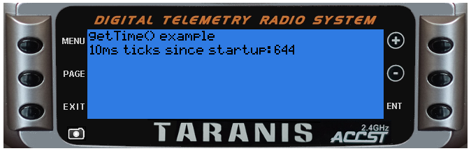

# getTime()

#####Overview
Returns the time since the radio was started in multiple of 10ms

 - Parameters: none
 - Returns: number Number of 10ms ticks since the radio was started
 - Status: current Introduced in 2.0.0

#####Example telemetry script

[Download gettime.lua](gettime.lua)

```lua
local function run(e)
  lcd.clear()
  lcd.drawText(1,1,"getTime() example",0)
  lcd.drawText(1,11,"10ms ticks since startup:", 0)
  lcd.drawText(lcd.getLastPos()+2,11,getTime(),0)
end

return{run=run}
```


#####Example output
