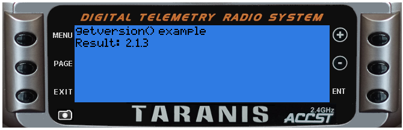

# getVersion()

#####Overview
Returns the OpenTX version number as a Lua string

 - Parameters: none
 - Returns: version number (as a Lua string)
 - Status: current Introduced in 2.1

#####Example telemetry script

```lua
local function run(e)
  lcd.clear()
  lcd.drawText(1,1,"getversion() example",0)
  lcd.drawText(1,11,"Result: ", 0)
  lcd.drawText(lcd.getLastPos()+2,11,getVersion(),0)
end

return{run=run}
```

#####Example output
