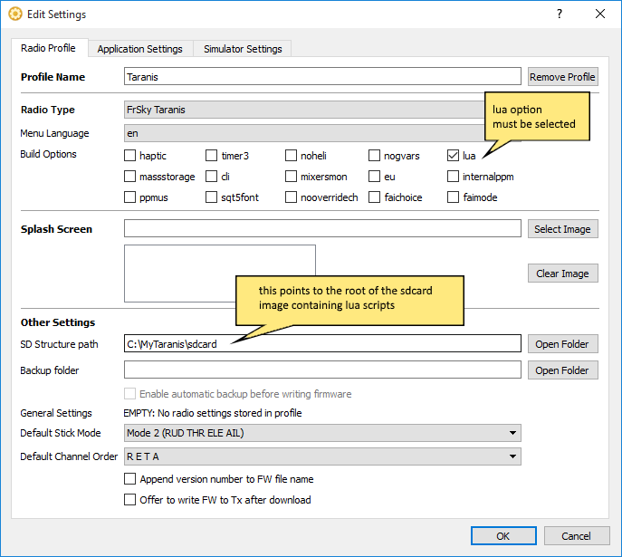

# Getting Started

## Downloading OpenTX Companion

OpenTX Companion 2.2 is available for download at [http://www.open-tx.org/downloads.html](http://www.open-tx.org/downloads.html)

## Updating firmware with Lua option selected

If you intend to use mixer scripts, when updating the firmware on your transmitter you need to make sure the lua option is checked in the settings for your radio profile \(Main menu -&gt; Settings -&gt;Settings...\) as shown below. This is not required if you only intend to run telemetry, one-time and function scripts, support for those is included by default.

Also note that the SD Structure path should contain a valid path to a copy of your transmitter's SD card contents, although that's not specific to Lua.

