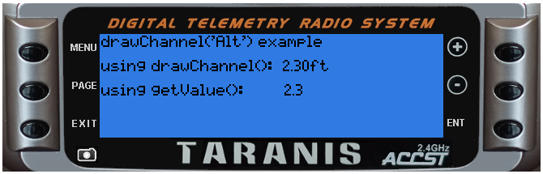

<!-- This file was generated by the script. Do not edit it, any changes will be lost! -->

## lcd.drawChannel(x, y, source, flags)


Display a telemetry value at (x,y)

@status current Introduced in 2.0.6, changed in 2.1.0 (only telemetry sources are valid)


#### Parameters

* `x,y` (positive numbers) starting coordinate

* `source` can be a source identifier (number) or a source name (string).
See getValue()

* `flags` (unsigned number) drawing flags


#### Return value

none


---

### Examples

<a class="dlbtn" href="https://raw.githubusercontent.com/opentx/lua-reference-guide/opentx_2.2/lcd/drawChannel-example.lua">lcd/drawChannel-example</a>

```lua
local function run(e)
  lcd.clear()
  lcd.drawText(1, 1, "drawChannel('Alt') example",0)
  lcd.drawText(1, 16, "using drawChannel(): ", 0)
  lcd.drawChannel(lcd.getLastPos()+20, 16 , "Alt", 0)
  lcd.drawText(1, 31, "using getValue(): ", 0)
  lcd.drawText(lcd.getLastPos() + 22, 31, getValue("Alt"), 0)
end

return{run=run}
```



