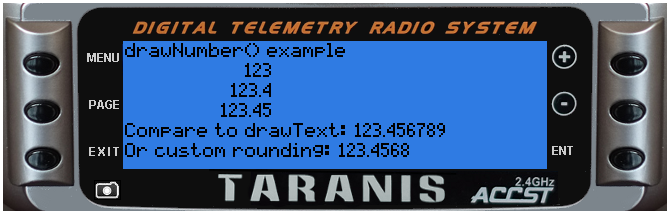

<!-- This file was generated by the script. Do not edit it, any changes will be lost! -->

## lcd.drawNumber(x, y, value [, flags])


Display a number at (x,y) 

@status current Introduced in 2.0.0


#### Parameters

* `x,y` (positive numbers) starting coordinate

* `value` (number) value to display

* `flags` (unsigned number) drawing flags: 
 * `0 or not specified` normal representation 
 * `PREC1` display with one decimal place (number 386 is displayed as 38.6)
 * `PREC2` display with tow decimal places (number 386 is displayed as 3.86)
 * other general LCD flag also apply


#### Return value

none


---

### Examples

<a class="dlbtn" href="https://raw.githubusercontent.com/opentx/lua-reference-guide/master/lcd/drawNumber-example.lua">lcd\drawNumber-example</a>

```lua
function round(num, decimals)
  local mult = 10^(decimals or 0)
  return math.floor(num * mult + 0.5) / mult
end

local function run(event)
  lcd.clear()
  lcd.drawText(1,1,"drawNumber() example", 0)
  local myNumber = 123.456789
  lcd.drawNumber(75, 11, myNumber, 0)
  lcd.drawNumber(75, 21, myNumber, PREC1)
  lcd.drawNumber(75, 31, myNumber, PREC2)
  lcd.drawText(1, 41, "Compare to drawText: " .. myNumber, 0)
  lcd.drawText(1, 51, "Or custom rounding: " .. round(myNumber, 4), 0)
end

return{run=run}
```



