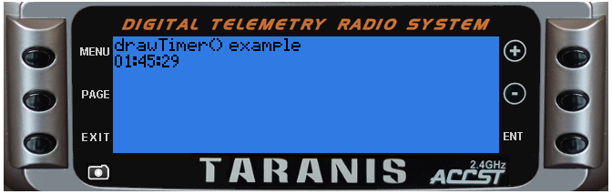

<!-- This file was generated by the script. Do not edit it, any changes will be lost! -->

## lcd.drawTimer(x, y, value [, flags])


Display a value formatted as time at (x,y) 

@status current Introduced in 2.0.0


#### Parameters

* `x,y` (positive numbers) starting coordinate

* `value` (number) time in seconds

* `flags` (unsigned number) drawing flags:
 * `0 or not specified` normal representation (minutes and seconds)
 * `TIMEHOUR` display hours
 * other general LCD flag also apply


#### Return value

none


---

### Examples

<a class="dlbtn" href="https://raw.githubusercontent.com/opentx/lua-reference-guide/master/lcd/drawTimer-example.lua">lcd/drawTimer-example</a>

```lua
local upTime

local function background()
  upTime = getTime() / 100
end

local function run(event)
  background()
  lcd.clear()
  lcd.drawText(1, 1,"drawTimer() example", 0)
  lcd.drawTimer(1, 10, upTime, TIMEHOUR)
end

return{run=run}
```



