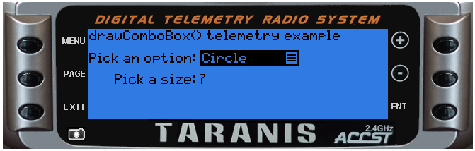

# lcd.drawCombobox\(x, y, w, list, idx \[, flags\]\)

Draw a combo box

@status current Introduced in 2.0.0

### Parameters

* `x,y` \(positive numbers\) top left corner position
* `w` \(number\) width of combo box in pixels
* `list` \(table\) combo box elements, each element is a string
* `idx` \(integer\) index of entry to highlight
* `flags` \(unsigned number\) drawing flags, the flags can not be combined:
  * `BLINK` combo box is expanded
  * `INVERS` combo box collapsed, text inversed
  * `0 or not present` combo box collapsed, text normal

### Return value

none

#### Notice

Only available on Taranis

## Examples

[lcd/drawCombobox-example](https://raw.githubusercontent.com/opentx/lua-reference-guide/opentx_2.2/lcd/drawCombobox-example.lua)

```lua
local comboOptions
local selectedOption
local selectedSize
local editMode
local activeField
local fieldMax

local function valueIncDec(event,value,min,max,step)
    if editMode then
      if event==EVT_PLUS_FIRST or event==EVT_PLUS_REPT then
        if value<=max-step then
          value=value+step
        end
      elseif event==EVT_MINUS_FIRST or event==EVT_MINUS_REPT then
        if value>=min+step then
          value=value-step
        end
      end
    end
    return value
  end

local function fieldIncDec(event,value,max,force)
    if editMode or force==true then
      if event==EVT_PLUS_FIRST then
        value=value+max
      elseif event==EVT_MINUS_FIRST then
        value=value+max+2
      end
      value=value%(max+1)
    end
    return value
  end

  local function getFieldFlags(p)
    local flg = 0
    if activeField==p then
      flg=INVERS
      if editMode then
        flg=INVERS+BLINK
      end
    end
    return flg
  end

local function init()
  fieldMax = 1
  comboOptions = {"Triangle","Circle","Square"}
  selectedOption = 0
  activeField = 0
  selectedSize = 0
end

local function run(event)
  lcd.clear()
  -- draw from the bottom up so we don't overwrite the combo box if open
  lcd.drawText(19, 32, "Pick a size:", 0)
  lcd.drawText(lcd.getLastPos() + 2, 32, selectedSize, getFieldFlags(1))
  lcd.drawText(1, 1, "drawComboBox() telemetry example",0)
  lcd.drawText(1, 17, "Pick an option:", 0)
  lcd.drawCombobox(lcd.getLastPos() + 2, 15, 70, comboOptions, selectedOption, getFieldFlags(0))

  if event == EVT_ENTER_BREAK then
    editMode = not editMode
  end
  if editMode then
    if activeField == 0 then
      selectedOption = fieldIncDec(event, selectedOption, 2)
    elseif activeField == 1 then
      selectedSize = valueIncDec(event, selectedSize, 0, 10, 1)
    end
  else
    activeField = fieldIncDec(event, activeField, fieldMax, true)
  end
end

return{run=run, init=init}
```



