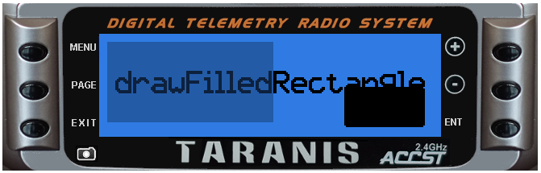

# lcd.drawFilledRectangle\(x, y, w, h \[, flags\]\)

Draw a solid rectangle from top left corner \(x,y\) of specified width and height

@status current Introduced in 2.0.0

### Parameters

* `x,y` \(positive numbers\) top left corner position
* `w` \(number\) width in pixels
* `h` \(number\) height in pixels
* `flags` \(unsigned number\) drawing flags

### Return value

none

## Examples

[lcd/drawFilledRectangle-example](https://raw.githubusercontent.com/opentx/lua-reference-guide/opentx_2.2/lcd/drawFilledRectangle-example.lua)

```lua
local function run()
  lcd.clear()
  lcd.drawText(10,22,"drawFilledRectangle()",DBLSIZE)
  lcd.drawFilledRectangle(5, 5, 103, 50, GREY_DEFAULT)
  lcd.drawFilledRectangle(152, 33, 50, 25, SOLID)
end

return{run=run}
```



