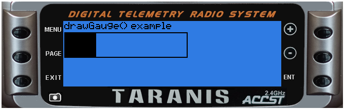

# lcd.drawGauge\(x, y, w, h, fill, maxfill \[, flags\]\)

Draw a simple gauge that is filled based upon fill value

@status current Introduced in 2.0.0, changed in 2.2.0

### Parameters

* `x,y` \(positive numbers\) top left corner position
* `w` \(number\) width in pixels
* `h` \(number\) height in pixels
* `fill` \(number\) amount of fill to apply
* `maxfill` \(number\) total value of fill
* `flags` \(unsigned number\) drawing flags

### Return value

none

## Examples

[lcd/drawGauge-example](https://raw.githubusercontent.com/opentx/lua-reference-guide/opentx_2.2/lcd/drawGauge-example.lua)

```lua
local function run(event)
  lcd.clear()
  lcd.drawText(1,1,"drawGauge() example", 0)
  lcd.drawGauge(1, 11, 120, 25, 250, 1000)
end

return{run=run}
```



