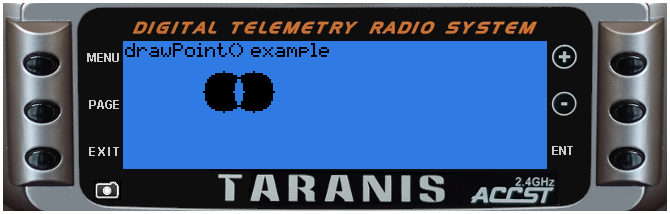

# lcd.drawPoint\(x, y\)

Draw a single pixel at \(x,y\) position

@status current Introduced in 2.0.0

### Parameters

* `x` \(positive number\) x position
* `y` \(positive number\) y position

### Return value

none

#### Notice

Taranis has an LCD display width of 212 pixels and height of 64 pixels. Position \(0,0\) is at top left. Y axis is negative, top line is 0, bottom line is 63. Drawing on an existing black pixel produces white pixel \(TODO check this!\)

## Examples

[lcd/drawPoint-example](https://raw.githubusercontent.com/opentx/lua-reference-guide/opentx_2.2/lcd/drawPoint-example.lua)

```lua
local function circle(xCenter, yCenter, radius)
  local y, x
  for y=-radius, radius do
    for x=-radius, radius do
        if(x*x+y*y <= radius*radius) then
            lcd.drawPoint(xCenter+x, yCenter+y)
        end
    end
  end
end


local function run(event)
  lcd.clear()
  lcd.drawText(1,1,"drawPoint() example", 0)
  circle(50, 25, 10)
  circle(65, 25, 10)
end

return{run=run}
```



